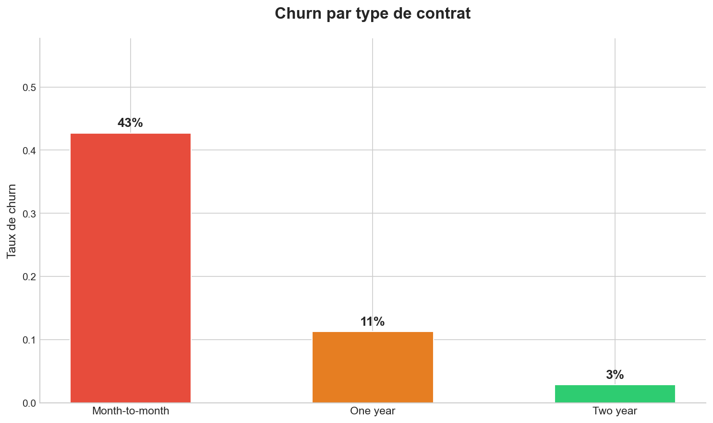
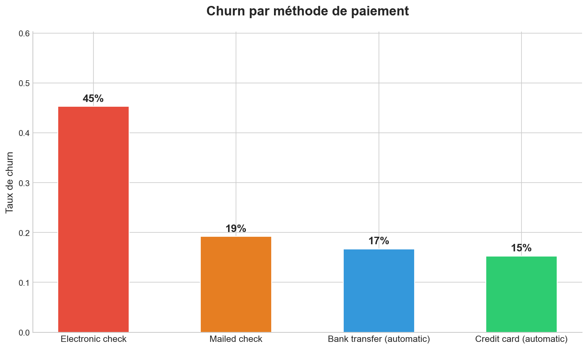
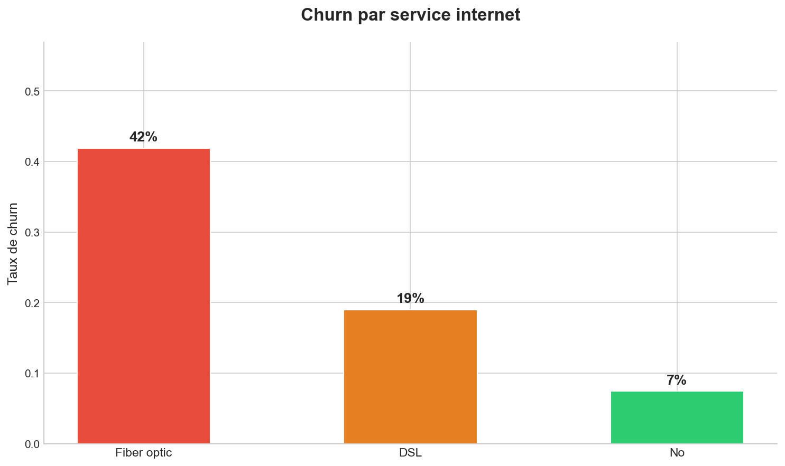
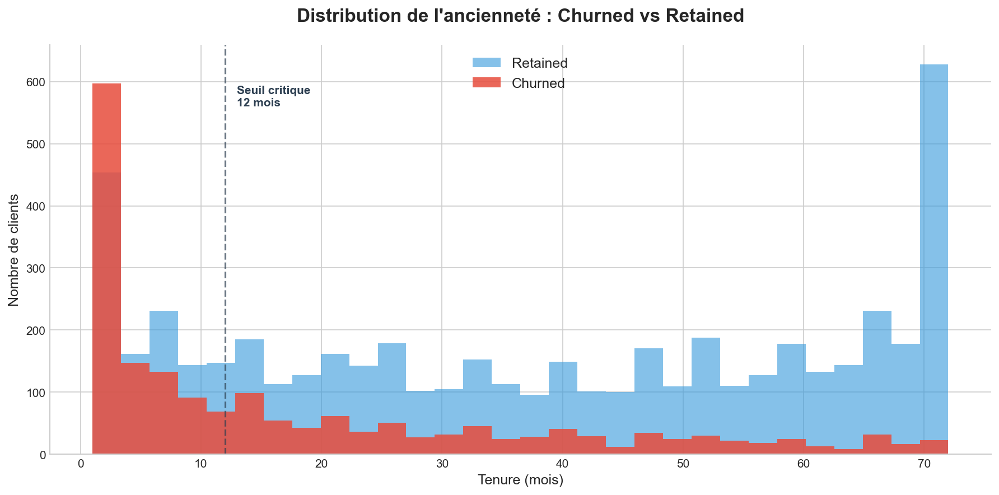

# Customer Churn Analysis — Telecom

## Project Overview
Analysis of 7,032 telecom customers to understand **why customers leave** 
and identify the key factors driving churn.

**Business Question:**
> "Which factors most influence customer churn, 
> and what can the business do to reduce it?"

---

## 📁 Dataset
- **Source:** [Telco Customer Churn — Kaggle](https://www.kaggle.com/datasets/blastchar/telco-customer-churn)
- **Size:** 7,032 customers × 21 features
- **Target variable:** `Churn` (Yes / No)

---

## Tools & Skills
- Python, Pandas, Matplotlib
- Data Cleaning & Feature Engineering
- Exploratory Data Analysis (EDA)
- Data Visualization & Storytelling

---

## Key Findings

### 1. Contract Type is the #1 Churn Driver
| Contract | Churn Rate |
|---|---|
| Month-to-month | **43%** 🔴 |
| One year | 11% 🟠 |
| Two year | 3% 🟢 |

### 2. Payment Method Matters
| Payment | Churn Rate |
|---|---|
| Electronic check | **45%** 🔴 |
| Credit card (auto) | 15% 🟢 |

### 3. Fiber Optic Has a Problem
- Fiber optic customers churn at **42%** despite being the premium service
- Possible causes : pricing dissatisfaction or quality issues

### 4. Churn Happens Early
- **73% of churn occurs in the first 12 months**
- Customers who survive past 12 months are significantly more loyal
- Average tenure of churned customers : **18 months vs 38 months** for retained

---

##  Business Recommendations
1. **Push annual/2-year contracts** with onboarding discounts
2. **Investigate Electronic Check users** — highest churn risk segment  
3. **Improve first 12-month experience** — critical retention window
4. **Review Fiber Optic pricing** — high churn despite premium positioning

---

## 📊 Visualizations

---

## 🗂️ Project Structure